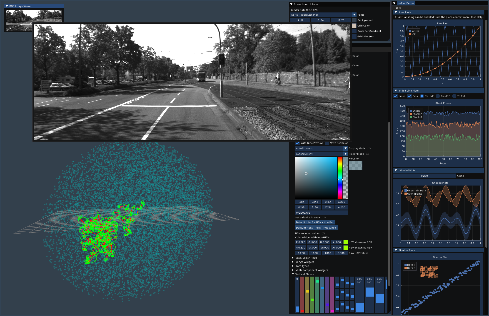

....
 ▄████▄   ██░ ██ ▓█████ ▓█████  ██▀███    ██████ 
▒██▀ ▀█  ▓██░ ██▒▓█   ▀ ▓█   ▀ ▓██ ▒ ██▒▒██    ▒ 
▒▓█    ▄ ▒██▀▀██░▒███   ▒███   ▓██ ░▄█ ▒░ ▓██▄   
▒▓▓▄ ▄██▒░▓█ ░██ ▒▓█  ▄ ▒▓█  ▄ ▒██▀▀█▄    ▒   ██▒
▒ ▓███▀ ░░▓█▒░██▓░▒████▒░▒████▒░██▓ ▒██▒▒██████▒▒
░ ░▒ ▒  ░ ▒ ░░▒░▒░░ ▒░ ░░░ ▒░ ░░ ▒▓ ░▒▓░▒ ▒▓▒ ▒ ░
  ░  ▒    ▒ ░▒░ ░ ░ ░  ░ ░ ░  ░  ░▒ ░ ▒░░ ░▒  ░ ░
░         ░  ░░ ░   ░      ░     ░░   ░ ░  ░  ░  
░ ░       ░  ░  ░   ░  ░   ░  ░   ░           ░  
░                                                
....

== Building

=== Build-time dependencies

* CMake version >= 3.14
* {cpp} compiler support {cpp} 17

=== Run-time dependencies

Install the following packages for building `+cheers-project+`:

* OpenGL
* GLEW
* GLFW3

Additional dependencies for building `+cheers-example+`:

* Eigen3

Other required packages will be automatically at build-time.

=== Building and running the demo

[source,bash]
----
mkdir build; cd build
cmake .. -DCMAKE_BUILD_TYPE={Release|Debug} -DCHEERS_BUILD_EXAMPLE={ON|OFF}
cmake --build .
----
Alternatively, if you have Ninja or Ccache installed, which are recommended for improving building process:
[source,bash]
----
cmake .. -G Ninja -DCMAKE_BUILD_TYPE={Release|Debug} -DCHEERS_BUILD_EXAMPLE={ON|OFF}
----

Run the examples if you have `+CHEERS_BUILD_EXAMPLE+` set to `+ON+`:
[source,bash,subs=+quotes]
----
./cheers-example/{cheers_example_st|cheers_example_mt} [{{_/path/to/image/sequence_}}]
----

== A Short Tutorial

There are two important concepts about Cheers: `+Window+` and `+Layer+`. The singleton class `+Window+` provides a convinient way for controlling the lifecycle of a visualization window as well as setting up the window attributes. The `+Layer+` class provides interfaces for the users to draw the 2D/3D stuff.

=== Window-lifecycle concept

A link:cheers-project/cheers/window/window.hpp[window] always starts with the call to `+Window::CreateContext()+`, and is destroyed after `+Window::DestroyContext()+` is called. The window lives within the create-render-destroy scope, util `+Window::WaitForWindowExiting()+` evaluates to `+true+`. A common use case is shown in link:cheers-example/cheers_example.cpp[example].

The following diagram shows the lifecycle of a `+Window+`:
[source,mermaid,id=window-lifecycle]
----
flowchart TB
  launch(["<b>Window launched</b>   Window::CreateContext()"]) --> |Optional| attrib
  attrib("Window::SetInitEyeAndUp()")                              --> ui

  subgraph loop [<b>Rendering thread</b>]
    direction TB

    ui("Window::UpdateUiEvents()")
    decide{{"Window::WaitForWindowExiting()"}}
    renew("Window::CreateRenderPrograms()   <b>calls</b> Layer::CreateRenderer()   <b>for newly installed layers</b>")
    update("Window::OnUpdateRenderData()   <b>calls</b> Layer::UpdateImFrame()   <b>calls</b> Layer::UpdateRenderData()")
    render("Window::OnRenderLayer()   <b>calls</b> Layer::RenderLayer()")
    destroy("Window::DeleteRenderPrograms()   <b>calls</b> Layer::DestroyRenderer()")

    ui     --> decide
    decide --> |Continue rendering?| renew
    renew  --> update
    update --> render
    render --> ui
  end

  decide  --> |User closes window?| destroy
  destroy ----> exit(["<b>Window exits</b>   Window::DestroyContext()"])
----

=== Layer-lifecycle concept

A link:cheers-project/cheers/layer/layer.hpp[layer] is where you draw 2D widgets or 3D objects. Corresponding to the window-lifecycle shown in the xref:window-lifecycle[diagram], a layer should inherits from the abstract `+Layer+` class and override the core callbacks to draw stuff during the window-lifecycle:

* `+Layer::OnCreateRenderer()+`: The user may call `+Layer::add_render_program()+` to create the shader programs. Also place the initailization of other resources here (`+VAO+`, `+VBO+` and textures, etc.).
* `+Layer::OnDestroyRenderer()+`: The user may call `+Layer::clear_render_program()+` to release all the shader programs. Optionally release other resources here or in the destructor.
* `+Layer::OnUpdateImFrame()+`: Put the `+ImGui+` stuff here.
* `+Layer::OnUpdateRenderData()+`: Place the preparation for the render data here. Call `+Layer::render_program()+` to access the shader programs. They are arranged in the order of creation.
* `+Layer::OnRenderLayer()+`: This is the place where the `+OpenGL+` drawcalls are emitted. Implement your `+OpenGL+` subroutines here.

Data-racing may happen when the user updates the render data in other threads, and uploads the vertex buffer in `+Layer::OnUpdateRenderData()+`. The user may utilize the built-in `+Layer::render_data_mutex()+` for convinience. Remember not to block the rendering thread for too long.

Here are the link:cheers-project/cheers/layer[built-in layers] implemented Cheers. You can install these layers or even inherit from the built-in layers. But do not inherit from `+SceneLayer+` or install it as it is default installed.

The lifecycle of a `+Layer+` is controlled by the window, and is rather simple:
[source,mermaid,id=layer-lifecycle]
----
flowchart TB
  install(["<b>User installed the layer</b>   Window::InstallSharedLayer()"]) --> |Window updates the UI events| create

  subgraph loop [<b>Rendering thread</b>]
    direction TB

    create("Layer::CreateRenderer()   <b>calls</b> Layer::OnCreateRenderer()")
    render2d("Layer::UpdateImFrame()   <b>calls</b> Layer::OnUpdateImFrame()")
    update("Layer::UpdateRenderData()   <b>calls</b> Layer::OnUpdateRenderData()")
    render3d("Layer::RenderLayer()   <b>calls</b> Layer::OnRenderLayer()")

    create --> render2d
    render2d --> update
    update   --> render3d
    render3d --> |Window updates the UI events| render2d
  end
  
  render3d --> |Window destroys the layer| destroy("Layer::DestroyRenderer()   <b>calls</b> Layer::OnDestroyRenderer()")
----

You can install new layers at any time by calling the thread-safe `+Window::InstallSharedLayer()+`, even not within the create-render-destroy scope.

=== Handling the UI events (experimental)

A close event is triggered when `+Ctlr-q+` is pressed. The window is then terminated gracefully. 

A stall event is triggered when `+Space+` is hit. The user may call `+Window::WaitForWindowStalled()+` to block the user thread until `+Space+` is hit again, or `+Ctlr-q+` is pressed. Do not call it in the same thread with `+Window::WaitForWindowExiting()+` as it will be blocked thus not responsing to `+Ctlr-q+`.

See the link:cheers-example/task.hpp[example] for more information.
